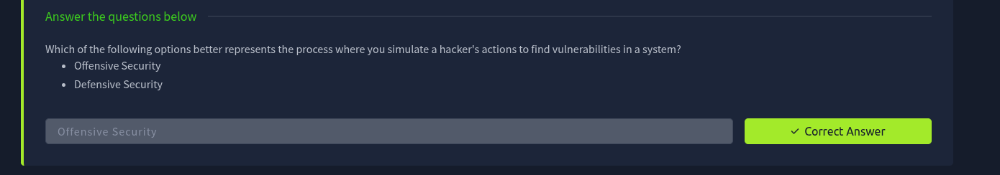

In short, offensive security is the process of breaking into computer systems, exploiting software bugs and finding loopholes in applications to gain unauthorized access to them.

To beat a hacker, we need to behave like a hacker, finding vulnerabilities and recommending patches before a cybercriminal does.

On the flip side, there is also defensive security, which is the process of protecting an organization's network and computer systems by analyzing and securing any potential digital threats. In a defensive role, we could be investigating infected computers or devices to understand how it was hacked, tracking down cybercriminals or monitoring infrastructure for malicious activity.

## Completed tasks

