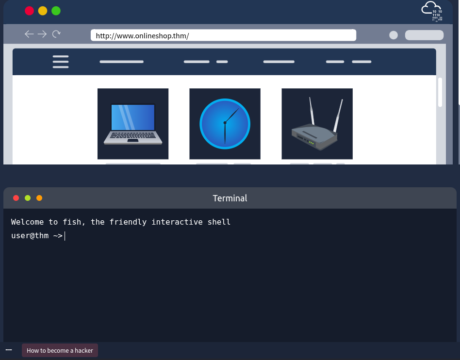
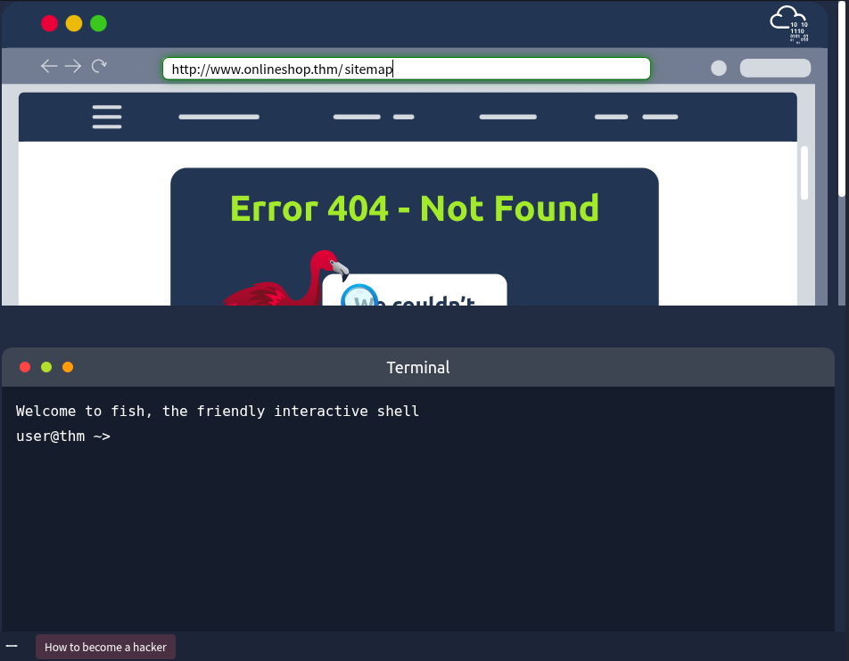
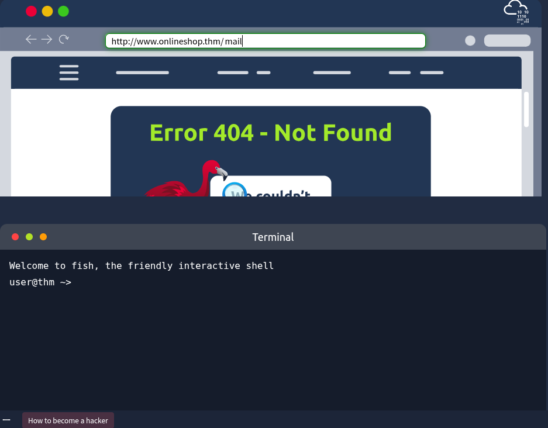
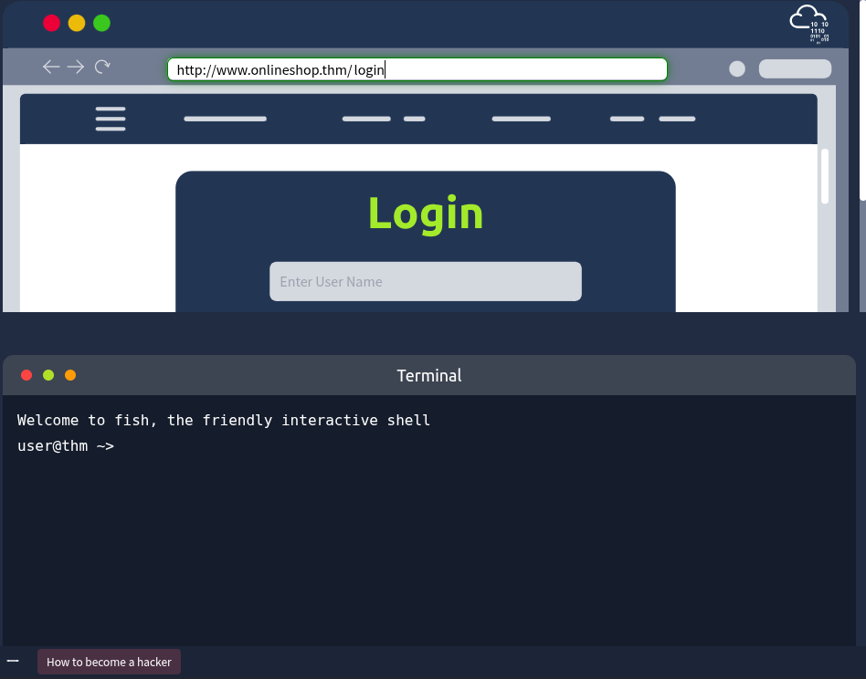
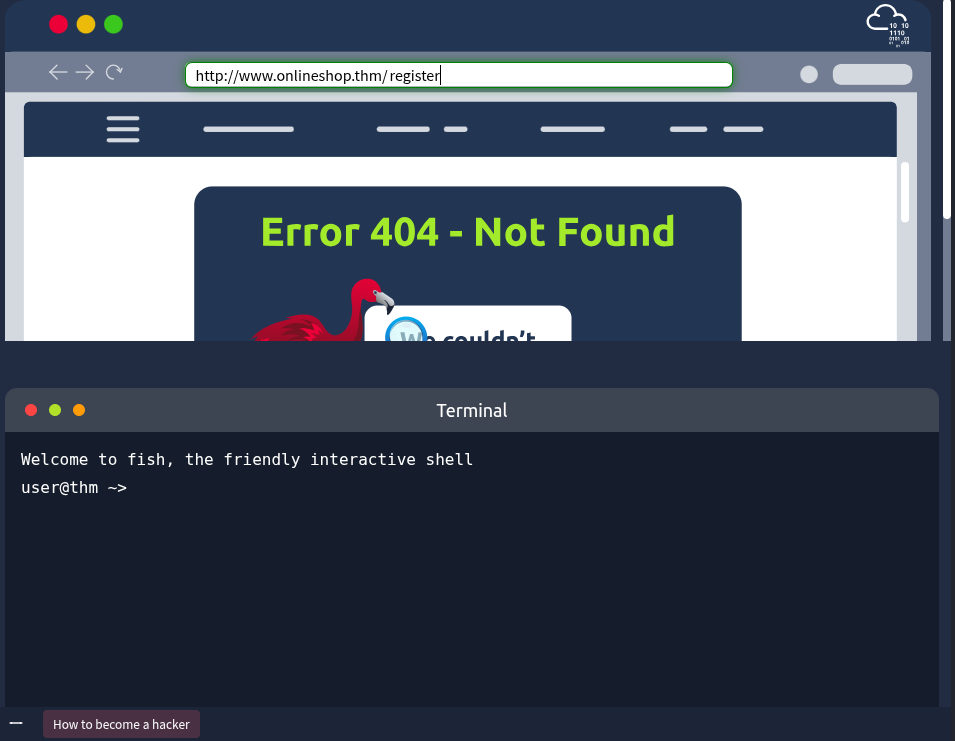
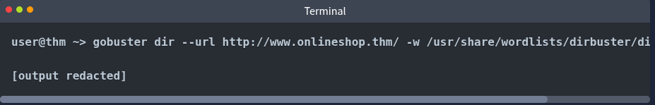
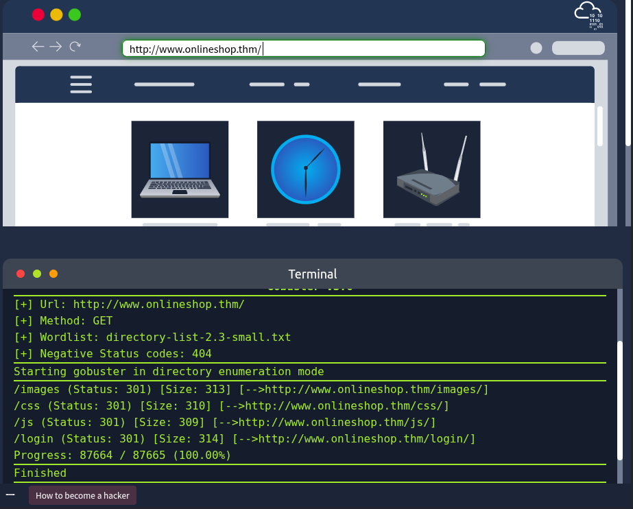
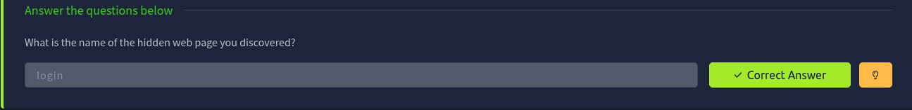

Scenario:

    After months of working on his business idea, Mike was finally ready to launch the website! He had spent much time and effort creating a great product and was confident that people would love it.

    However, Mike was also nervous about the potential for cyber threats. He knew that businesses of all sizes were being hacked every day, and he did not want to be a victim. We get a call asking us to asses his web application and see if we can spot any weaknesses. In particular, he is concerned that the software development team might have forgotten some private pages exposed to the public. He hopes we can find them before he goes public and the bad guys find them and wreak havoc.

In the upper half, there is a simulated browser window showing *http://www.onlineshop.thm*. We can interact with the address bar. In the lower half, there is a simulated terminal.

We can run many security tests, but first, let's see if we can discover any hidden pages. Here are some pages we can try:
- **sitemap** (we can use the embedded browser to check if http://www.onlineshop.thm/sitemap exists.)

- mail

- login

- register

- admin

## Using an Automated Tool: Gobuster
Changing the browser's address bar is helpful (shown above) if the list of pages you want to try is limited. What if we have hundreds or thousands of words to try? We need to use an **automated tools**. A solid tool to automatically search for hidden pages is Gobuster, which runs in the terminal. In the terminal (in the lower half), we need to issue the following command:

The command above is made up of the following parts:
- **gobuster** is the terminal command to start Gobuster
- **dir** uses directory and file enumeration mod
- **--url http://www.onlineshop.thm** sets the target website
- **-w /usr/share/wordlists/dirbuster/directory-list.txt** specifies the word list to use

## Completed tasks

