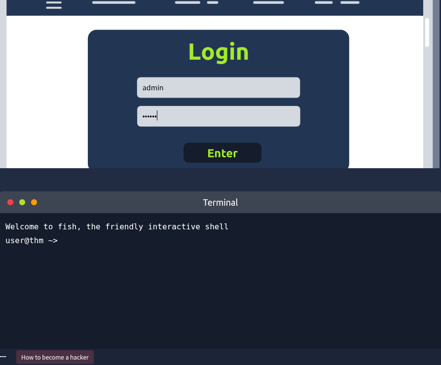

One of the most common username is *admin*. We will start using *admin* as the username and one of the common passwords listed below:
- abc123
- 123456
- qwerty
- password
- 654321

        One of the above passwords should work with the username *admin* and give us access to a secret page.



## Using an Automated Tool: Hydra
We could do this task manually, as we only had to go through five passwords. But what if we have to go through thousands or tens of thousands of passwords? In that case, we can use a software tool such as Hydra. In the terminal, on the lower half, run the following command:

```
