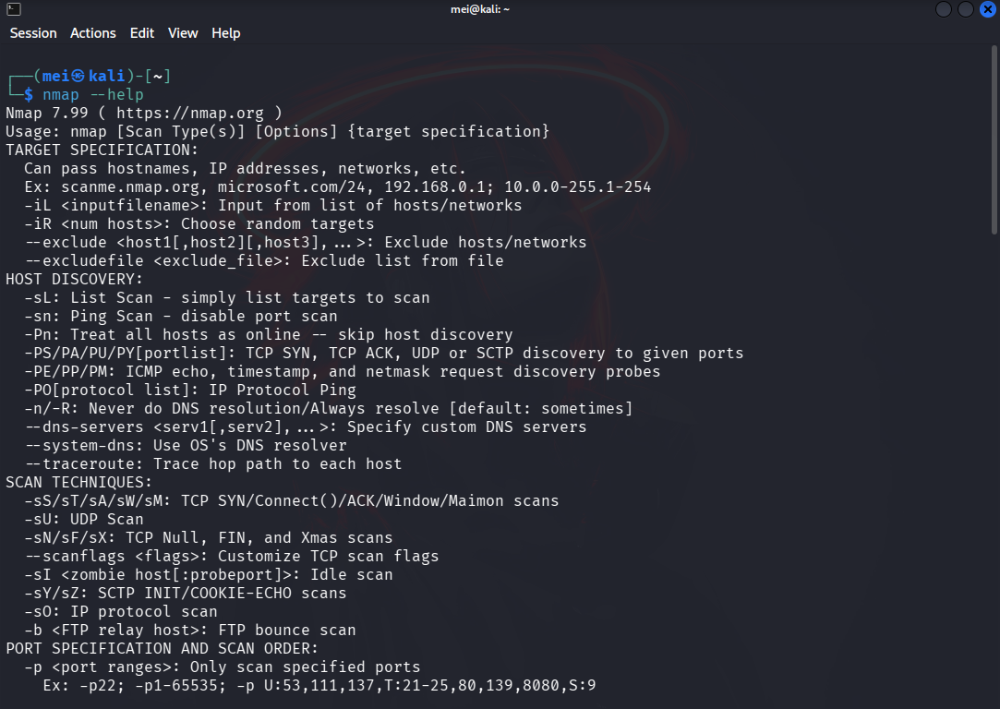
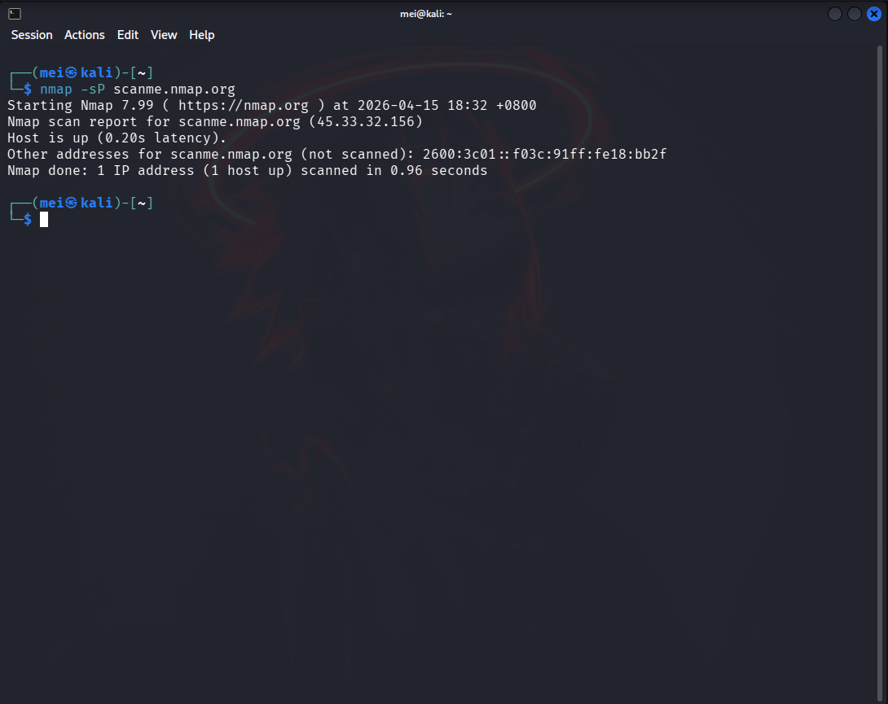
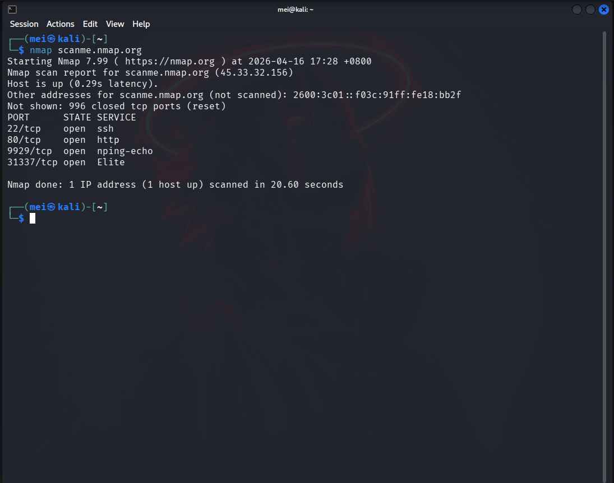
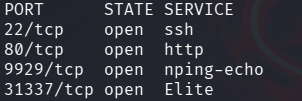

Nmap is an advanced information-gathering and **port scanning** tool that hackers and pentesters use to obtain information about the systems they intend to hack or test.

What actually happend is before the pentesters/hackers is hacking/testing a system, they need to collect information about their target systems. They search for openings and possible access points for infiltration.

Nmap collects these information quite skillfully and masterfully. Nmap is a port scanning tool. It scans for open ports, vulnerabilities, and various services running on a system.

## Practical training
The first thing that is useful to do when learning new tool is to check the options it offers. Type in the command *nmap --help*, as shown in the image below.

Before scanning a target network with Nmap, we should always check whether the network is up and running or not. If it is not running, then it is pointless to scan.

### WARNING: Do not randomly scan any IP addresses or domain names with nmap. It is **illegal**. This repository is for **educational purposes** only. We can specify the IP address or the domain name. For this lesson, we will use the nmap subdomain *scanme.nmap.org* for learning and practicing Nmap.

    nmap -sP scanme.nmap.org

- -s - to scan the IP address or domain
- -P - ping the IP address or domain

## Scanning
By default, nmap scan the most popular 1000 ports. As shown in the image below:

### Analysis
The first important thing nmap does for us is it shows the IPv4 address and IPv6 of the specified domain name we provided, *scanme.nmap.org*.

    Nmap scan report for scanme.nmap.org (45.33.32.156)
    Other addresses for scanme.nmap.org (not scanned): 2600:3c01::f03c:91ff:fe18:bb2f

The three main result in an nmap scan are the **port**, **state**, and **service**.

---
|PORT|STATE|SERVICE|
|----|-----|-------|
|Display the port number|Display the state of the port *open* or *filtered*|Display the types of service running on the port|
---

For the STATE column, the *open* signifies that the port is open and ready to accept connections. When it is *filtered*, it signifies that the port may be protected by it's firewall, only the authorized user/users can access the port number.
